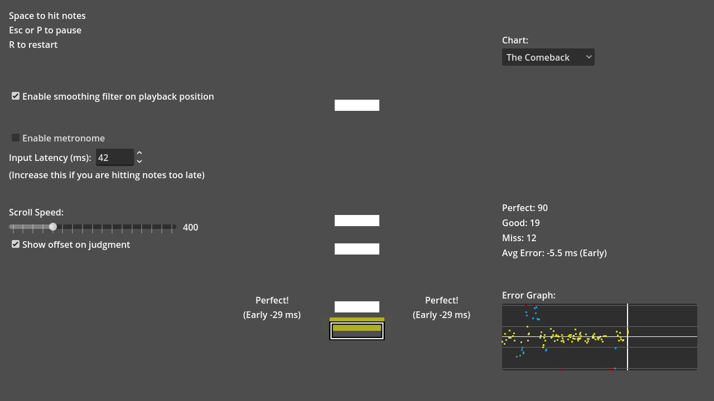

# Rever-beat

A rhythm game built with Godot and GDScript. Gameplay timing is aligned to music playback using the [1€ filter](https://gery.casiez.net/1euro/) to reduce playback-position jitter. The timing approach is based on [Godot's audio synchronization guide](https://docs.godotengine.org/en/stable/tutorials/audio/sync_with_audio.html).

The metronome sound was recorded by Ludwig Peter Müller in December 2020 under
the "Creative Commons CC0 1.0 Universal" license.

Language: GDScript

Renderer: Compatibility

Check out this demo on the asset library: TBD

## Run the project

1. Install [Godot 4.7.2](https://godotengine.org/download/).
2. In Godot Project Manager, choose **Import** and select this repository's `project.godot`.
3. Open the project and press **F5** to run the project.

## Automated checks

GitHub Actions runs on every push and pull request. It imports project resources with Godot 4.7.2 in headless mode and invokes the core GDScript tests in `tests/test_core.gd` through `scripts/test_runner.gd`.

To run the same checks locally from the project directory:

```sh
godot --headless --editor --path . --import
godot --headless --path . --script res://scripts/test_runner.gd
```

## Screenshots


